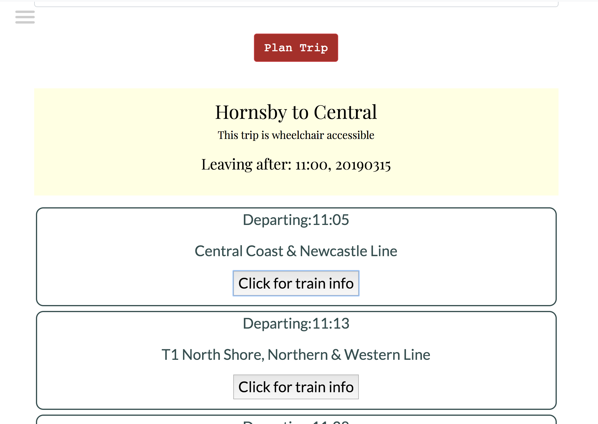

# Project 3 Syd-ax

This project was completed as my final project in the General Assembly Web Development Immersive. The application aims to help wheelchair users navigate the Sydney train network. The ultimate goal of the project will be to allow users to log in and confirm trips in which they will be traveling. This information will be used to let the appropriate station guards know, so they can be prepared to assist wheelchair users onto the train.

See live demo here: https://jessdiv.github.io/project3-syd-ax/

## Built With
- Rails
- PostgresQL
- React
- JavaScript
- HTML
- CSS
- Heroku to deploy backend
- Github pages to deploy app

### Trip search

Users fill in this form to display upcoming trips between two train stations.

Once the form is submitted, the results will show up as below. If the trip is wheelchair accessible it will be displayed just below the chosen route.

### Station search

## Pain Points
- Using the transport NSW API
  - While giving me loads of great information, it took me a long time to wrap my head around the usage and how to best extract the information I needed.
- Learning react
  - Not so much a pain point, but defintiely something that took up a large amount of my time considering it was my first react app!

## TODO
- fix bug in search bar when trip is more than one leg.
- refresh the displayTrip component when the search is submitted for a second time. 
- Complete the users/trips back end models to allow users to log their upcoming trips.
- Export trip data as json ready for integrations with transport NSW systems.
